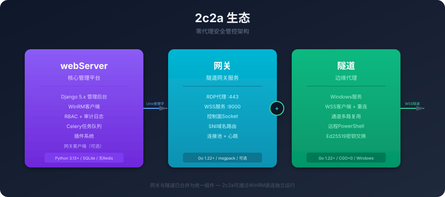
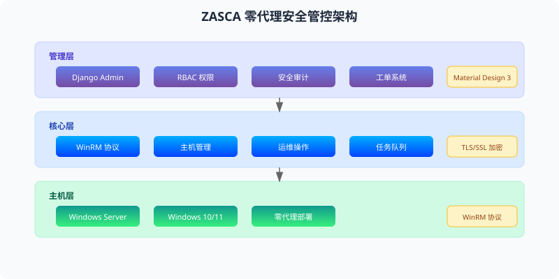

<div align="center">


<h1>2c2a</h1>

<p>
  <strong>Cloudy Computer Account Activation Integration Platform</strong><br>
  一个专业的共享云计算机多机账户开通平台
</p>

<p>
  
  
  
  
</p>

</div>

***

## 生态概览



### 2c2a

核心管理平台，基于 Django 5.x，提供 Web 管理后台和 RESTful API。

- **零代理架构**：通过 WinRM 协议直接管控 Windows 主机，无需安装客户端
- **Django Admin 优先**：最大化利用内置管理功能，降低学习成本
- **松耦合设计**：Gateway 为可选组件，2c2a 可独立运行
- **无 Redis 依赖**：Celery 使用 SQLite broker，部署更简单

### Gateway

隧道网关服务，基于 Go 1.22+，为零公网 IP 主机提供安全 RDP 访问通道。

- **RDP 代理**：TLS SNI 域名路由，自动转发到对应隧道
- **WSS 隧道**：WebSocket 接入层，支持心跳检测和连接池
- **控制面**：Unix Domain Socket + msgpack 协议，Django 可控
- **可选部署**：不部署时 2c2a 通过 WinRM 直连，功能完全可用

### Tunnel

边缘代理，基于 Go 1.22+，部署在被管 Windows 主机上的轻量级隧道代理。

- **Windows 服务**：安装为系统服务，开机自启
- **多路复用**：单条 WSS 连接承载 RDP/WinRM/RemoteExec
- **自动重连**：指数退避策略，网络中断自动恢复
- **CI/CD**：推送 tag 自动构建 Windows 可执行文件

## 核心特性


- **零代理架构**：无需在目标主机安装客户端软件，通过 WinRM 协议直接管控
- **Gateway 隧道保护**：可选部署 Gateway，为零公网 IP 主机提供安全 RDP 访问
- **Django Admin 优先**：最大化利用 Django 内置管理功能，降低学习成本
- **Material Design 3**：现代化的前端用户体验，支持多主题切换
- **RBAC 权限控制**：细粒度的角色和权限管理，满足企业合规要求
- **安全审计**：完整的操作日志和安全监控，支持行为分析
- **工单系统**：标准化的运维流程管理，提升协作效率
- **主机保护模式**：按产品粒度配置，通过 Gateway 隧道隔离主机

## 系统架构



2c2a 采用四层架构设计：

- **管理层**：Django Admin、RBAC 权限、安全审计、工单系统、主机保护配置
- **核心层**：WinRM 客户端、Celery 任务队列、GatewayClient、证书管理
- **网关层**（可选）：RDP 代理 (SNI 路由)、WSS 隧道服务、控制面
- **边缘层**：Windows 服务、WSS 客户端、多路复用、远程执行

## 仓库

| 仓库                                         | 语言            | 说明                   |
| ------------------------------------------ | ------------- | -------------------- |
| [2c2a](https://github.com/2c2a/webServer)       | Python/Django | 核心管理平台               |
| [Gateway](https://github.com/2c2a/gateway) | Go            | 隧道网关                 |
| [Tunnel](https://github.com/2c2a/tunnel)   | Go            | 边缘代理（已合并到Gateway并归档） |

## 快速开始

```bash
git clone https://github.com/2c2a/webServer.git
cd 2c2a
cp .env.example .env
uv sync
uv run python manage.py migrate
uv run python manage.py createsuperuser
uv run python manage.py runserver
```

访问 `http://127.0.0.1:8000/admin/` 进入管理后台。

## 安全特性

- 基于角色的访问控制 (RBAC)
- 数据传输加密 (TLS/SSL)
- 敏感信息加密存储
- 完整的操作审计日志（含隧道/RDP事件）
- 多因素认证支持
- 防暴力破解机制
- 安全启动和会话管理
- 主机保护模式（Gateway 隧道隔离）
- Ed25519 密钥交换

## 联系我们

- 组织主页: <https://github.com/2c2a>
- 问题反馈: [GitHub Issues](https://github.com/2c2a/2c2a/issues)

***

<div align="center">

*2c2a - 让 Windows 主机管理更简单、更安全*

</div>
