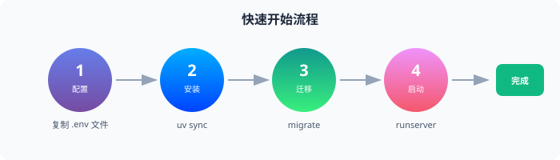

<div align="center">


<h1>ZASCA Team</h1>

<p>
  <strong>Zero Agent Security Control Architecture</strong><br>
  基于 Django 的企业级 Windows 主机远程管理平台
</p>

<p>
  
  
  
  
</p>

</div>

---

## 关于 ZASCA

ZASCA（Zero Agent Security Control Architecture）是一个采用**零代理架构**的企业级 Windows 主机远程管理平台。通过 WinRM 协议直接管控目标主机，无需安装任何客户端软件，为企业提供安全、高效的运维管理解决方案。

### 核心特性


- **零代理架构**：无需在目标主机安装客户端软件，通过 WinRM 协议直接管控
- **Django Admin 优先**：最大化利用 Django 内置管理功能，降低学习成本
- **Material Design 3**：现代化的前端用户体验，支持多主题切换
- **RBAC 权限控制**：细粒度的角色和权限管理，满足企业合规要求
- **安全审计**：完整的操作日志和安全监控，支持行为分析
- **工单系统**：标准化的运维流程管理，提升协作效率

### 系统架构


ZASCA 采用分层架构设计：

- **管理层**：提供 Django Admin、RBAC 权限、安全审计、工单系统等管理功能
- **核心层**：基于 WinRM 协议实现主机管理、运维操作和任务队列调度
- **主机层**：支持 Windows Server 和 Windows 10/11，无需安装任何代理程序

## 快速开始



### 环境要求

- Python 3.13+（由 `.python-version` 文件指定）
- PostgreSQL 12+（可选，也可使用 SQLite）
- Redis 6.0+（可选，用于缓存和 Celery）

### 快速部署

```bash
# 克隆项目
git clone https://github.com/zascateam/ZASCA.git
cd ZASCA

# 复制环境配置文件
cp .env.example .env

# 同步依赖（UV 会自动创建虚拟环境）
uv sync

# 数据库迁移
uv run python manage.py migrate

# 创建超级用户
uv run python manage.py createsuperuser

# 启动开发服务器
uv run python manage.py runserver
```

访问 `http://127.0.0.1:8000/admin/` 进入管理后台。

> **注意**：本项目使用 [UV](https://github.com/astral-sh/uv) 作为 Python 包管理器。所有 Python 命令都必须通过 `uv run` 执行。

## 项目结构

```
ZASCA/
├── apps/                 # 应用模块
│   ├── accounts/        # 用户认证
│   ├── hosts/          # 主机管理
│   ├── operations/     # 运维操作
│   ├── audit/          # 审计日志
│   ├── dashboard/      # 仪表盘
│   ├── bootstrap/      # 安全启动
│   ├── certificates/   # 证书管理
│   ├── plugins/        # 插件系统
│   └── themes/         # 主题管理
├── config/             # 项目配置
├── docs/              # 技术文档
├── frontend/          # 前端静态文件和模板
├── static/            # 静态文件
├── templates/         # 模板文件
├── utils/             # 工具模块
├── .env.example       # 环境配置模板
├── .env               # 环境配置文件 (git ignore)
├── pyproject.toml     # 项目依赖 (UV)
└── uv.lock            # 锁定依赖版本
```

## 安全特性

- 基于角色的访问控制 (RBAC)
- 数据传输加密 (TLS/SSL)
- 敏感信息加密存储
- 完整的操作审计日志
- 多因素认证支持
- 防暴力破解机制
- 安全启动和会话管理

## 文档

详细的项目文档请查看 [`docs/`](https://github.com/zascateam/ZASCA/tree/main/docs) 目录：

- [开发规范指南](https://github.com/zascateam/ZASCA/blob/main/docs/00_开发规范指南.md) - 强制执行的开发标准
- [项目架构与设计](https://github.com/zascateam/ZASCA/blob/main/docs/01_项目架构与设计.md) - 系统架构和技术选型
- [API接口文档](https://github.com/zascateam/ZASCA/blob/main/docs/02_API接口文档.md) - RESTful API 详细说明
- [Database Schema](https://github.com/zascateam/ZASCA/blob/main/docs/03_Database_Schema.md) - 数据库设计和表结构
- [部署运维手册](https://github.com/zascateam/ZASCA/blob/main/docs/04_部署运维手册.md) - 生产环境部署指南
- [更新日志](https://github.com/zascateam/ZASCA/blob/main/docs/05_更新日志.md) - 版本发布历史
- [安全配置指南](https://github.com/zascateam/ZASCA/blob/main/docs/06_安全配置指南.md) - 安全策略和防护措施

## 贡献指南

我们欢迎任何形式的贡献！请先阅读我们的[开发规范指南](https://github.com/zascateam/ZASCA/blob/main/docs/00_开发规范指南.md)。

### 开发流程

1. Fork 项目
2. 创建功能分支 (`git checkout -b feature/amazing-feature`)
3. 提交更改 (`git commit -m 'Add some amazing feature'`)
4. 推送到分支 (`git push origin feature/amazing-feature`)
5. 开启 Pull Request

## 联系我们

- 项目主页: https://github.com/zascateam/ZASCA
- 问题反馈: [GitHub Issues](https://github.com/zascateam/ZASCA/issues)

---

<div align="center">

*ZASCA - 让 Windows 主机管理更简单、更安全*

</div>
